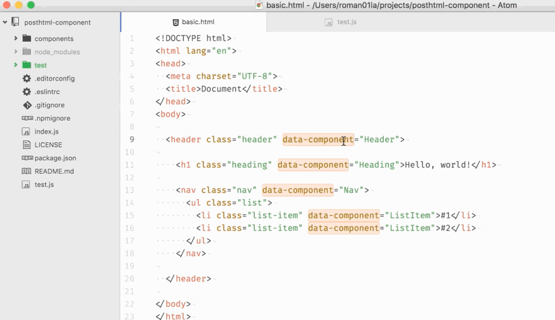

# Extract annotated HTML components from HTML documents into React components



## Installation

```
$ npm i html-to-react-components
```

## Usage

HTML components should be annotated with `data-component` attribute, the value of the attribute will be the name of the React component.

```js
import extractReactComponents from 'html-to-react-components';

extractReactComponents(
`<!DOCTYPE html>
<html lang="en">
<head>
  <meta charset="UTF-8">
  <title>Document</title>
</head>
<body>

  <header class="header" data-component="Header">

    <h1 class="heading" data-component="Heading">Hello, world!</h1>

    <nav class="nav" data-component="Nav">
      <ul class="list">
        <li class="list-item" data-component="ListItem">#1</li>
        <li class="list-item" data-component="ListItem">#2</li>
      </ul>
    </nav>

  </header>

</body>
</html>
`, { componentType: 'stateless' });

/*
{ Header: 'const Header = () => <header className="header">\n\n    <Heading></Heading>\n\n    <Nav></Nav>\n\n  </header>;',
  Heading: 'const Heading = () => <h1 className="heading">Hello, world!</h1>;',
  Nav: 'const Nav = () => <nav className="nav">\n      <ul className="list">\n        <ListItem></ListItem>\n        <ListItem></ListItem>\n      </ul>\n    </nav>;',
  ListItem: 'const ListItem = () => <li className="list-item">#2</li>;' }
*/
```

## Options

### componentType

- stateless
- es5 (default)
- es6

### moduleType

- false (do not extract as modules)
- es6 (default)
- cjs (CommonJS)

### moduleFileNameDelimiter

Delimiter character to be used in the name for imported children modules.

Default is `-`;

### output

Save components as files.

- path (output directory path)
- fileExtension (default is `js`)

## License

MIT
